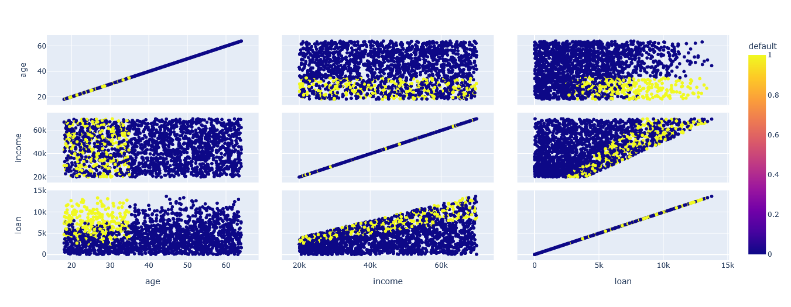
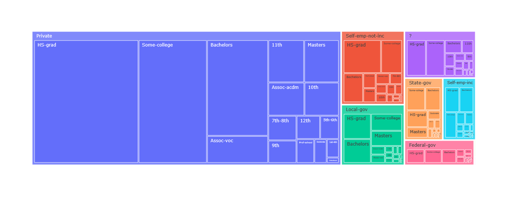
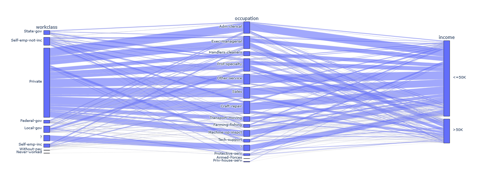

# DataScience-Estudos
Contém meus estudos iniciais em DataScience. Com visualização de dados, numpy e outras ferramentas.

Principalmente, este projeto apresenta o fluxo completo de limpeza e tratamento de dados para Machine Learning, utilizando duas bases de dados distintas: uma base de concessão de crédito (credit_data) e uma base de censo demográfico (census).

Foi utilizado o google colab para criação dos notebooks aqui salvos, em cada um deles consta um link direto.

## Tecnologias Utilizadas

    Python 3.x

    Pandas: Manipulação e análise de dados.

    NumPy: Operações matemáticas.

    Plotly: Gráficos dinâmicos e interativos.

    Seaborn/Matplotlib: Visualização estatística.

    Scikit-Learn: Escalonamento e codificação de variáveis.

    Google Colab: Utilização do Jupyter Notebook com integração ao Google Drive

## Bases de Dados
### Base de Crédito (credit_data)

Focada na previsão de inadimplência.

* Visualizações simples e dinâmicas (plotly)
* Tratamentos realizados:

  * Identificação e correção de valores inconsistentes (ex: idades negativas substituídas pela média).

  * Tratamento de valores faltantes (NaN) via imputação com a média.

  * Escalonamento (Feature Scaling): Aplicação de StandardScaler para normalizar atributos como renda, idade e dívida, evitando que a diferença de escala prejudique algoritmos de distância (como KNN ou Redes Neurais).

### Base do Censo (census)

Focada em classificação socioeconômica.

* Análise exploratória com histogramas e gráficos de contagem.

* Visualização Avançada: Uso de Treemaps e Parallel Categories via Plotly para entender a hierarquia entre profissão, escolaridade e renda.
  
* Tratamentos realizados:
    * Codificação de Variáveis Categóricas:

      1. LabelEncoder / OrdinalEncoder: Para transformar textos em números de forma otimizada.

      2. OneHotEncoder: Criação de variáveis dummy para atributos nominais, utilizando ColumnTransformer para manter o processamento eficiente em matrizes esparsas (evitando gargalos de memória RAM).
     
    * Escalonamento: Aplicação de StandardScaler evitando variáveis já tratadas com OneHotEncoder

## Como executar o projeto
Certifique-se de ter as bibliotecas instaladas:

```pip install pandas numpy plotly seaborn scikit-learn matplotlib```
    
  Carregue os arquivos .csv correspondentes nas pastas do projeto.
  Execute o notebook/script para visualizar os gráficos interativos e as transformações nos DataFrames.

## Conceitos Abordados

    Matrizes Esparsas vs. Densas: Explicação sobre por que manter dados em formato esparso após o One-Hot Encoding para economizar memória.

    Padronização: Por que a padronização é preferível à normalização em bases com outliers.

    Data Cleaning: A importância de tratar dados inconsistentes antes de alimentar modelos preditivos.


## Visualizações

Aqui estão alguns dos insights obtidos durante a análise exploratória:

### Gráfico de Dispersão (Base de Crédito)
Este gráfico mostra a relação entre idade, renda e dívida, destacando os clientes inadimplentes.



### Treemap de Ocupação (Base de Censo)
Visualização hierárquica das profissões e níveis de escolaridade.



### Parallel Categories (Base de Censo)
Faz ligações das relações entre classe de profissão (workclass), a profissão e a renda.




